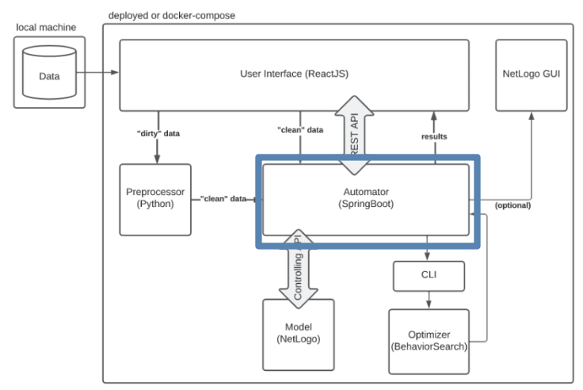

# Automator
The “Automator” will function as a backend in our system. It takes in the clean data in csv form and lets the model run using that data via the controlling API. It also connects to the “Optimizer” via the CLI. It is connected to the User Interface of our system over a REST API.



## To Run
To run the application:\\
```./mvnw spring-boot:run``` in terminal or run from ```AutomatorApplication.java``` using IDE created "run" button\\

To run the services:\\
```curl localhost:8080``` in a separate terminal window or open 'localhost:8080/*command*' in browser